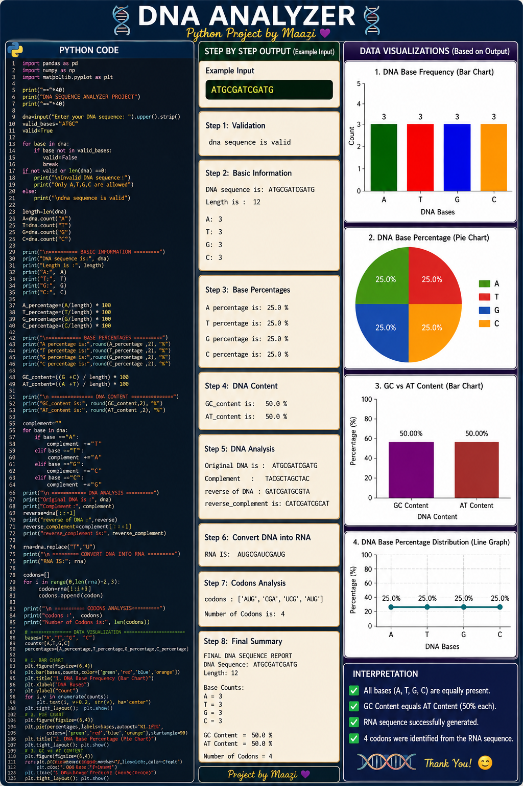

# 🧬 DNA ANALYZER

### Python Project by Maazi 💜

A Python-based **Computational Biology** project designed to analyze DNA sequences and visualize important biological data.

---

## 🚀 Features

- DNA sequence validation
- DNA length calculation
- Counting A, T, G, and C bases
- Base percentage calculation
- GC content analysis
- AT content analysis
- DNA complement generation
- Reverse DNA sequence
- Reverse complement generation
- DNA to RNA conversion
- Codon analysis
- Data visualization using Python

---

## 📊 Visualizations

This project generates:

1. DNA Base Frequency Bar Chart
2. DNA Base Percentage Pie Chart
3. GC Content vs AT Content Chart
4. DNA Base Percentage Distribution Line Graph

---

## 🛠️ Technologies Used

- Python
- Pandas
- NumPy
- Matplotlib

---

## ▶️ How to Run

Install the required libraries:

```bash
pip install -r requirements.txt

Then run your file:

python "dna sequence analyzer.py"
🧪 Example DNA Sequence
"ATGCGATCGATG"

👨‍💻 Author

---> Muhammad Maaz

🧬 Computational Biologist
